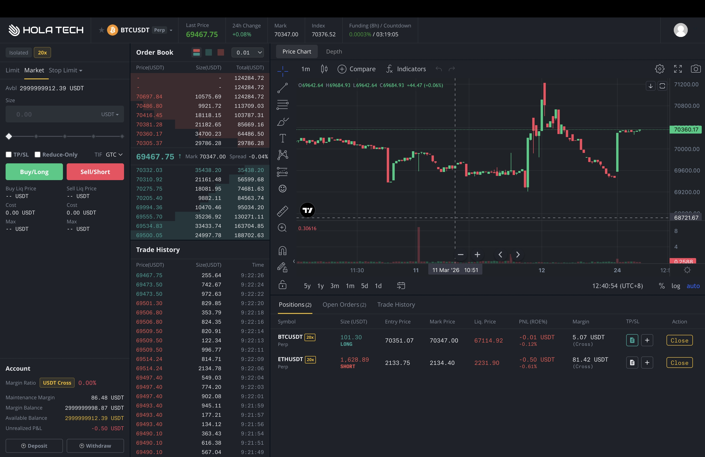
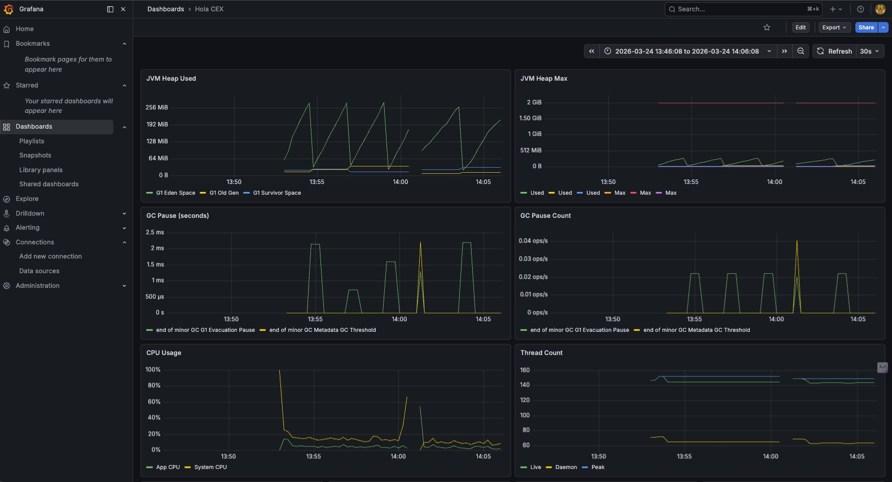

# High-Performance Matching Engine (Spot & Perpetual Futures) — Java / Kafka / MongoDB

[](https://openjdk.org/projects/jdk/17/)
[](https://spring.io/projects/spring-boot)
[](https://kafka.apache.org/)
[](https://www.mongodb.com/)
[](https://redis.io/)

A high-performance trading engine for spot and perpetual futures markets, built with Java 17, Spring Boot, Kafka, and MongoDB.

This project demonstrates how to build a low-latency, event-driven matching engine using an event-sourced, single-writer architecture. It includes a USDT-margined perpetual futures engine, a spot CLOB, liquidation, funding-rate settlements, WebSocket/REST APIs, and monitoring.

> **Disclaimer:** This repository is provided for educational and infrastructure demonstration purposes only. It does NOT include custody or wallet infrastructure, KYC/AML compliance systems, or regulatory licensing. Operating a real exchange requires proper legal and regulatory approval in your jurisdiction.

---

## Example Use Cases

- Research on matching engine design and event-sourced architectures
- Building internal trading simulators or backtesting environments
- Learning low-latency system design with Kafka and Java
- Reference implementation for CLOB order book mechanics
- Studying perpetual futures mechanics (funding rate, liquidation, ADL)

---

## Features

| Feature | Status |
|---|:---:|
| Spot order book (CLOB matching engine) | ✅ |
| USDT-margined perpetual futures engine | ✅ |
| Funding rate settlement (8h intervals) | ✅ |
| Liquidation engine + Insurance Fund | ✅ |
| Auto-Deleveraging (ADL) | ✅ |
| Stop-Loss / Take-Profit (conditional orders) | ✅ |
| Per-position leverage adjustment (up to 125×) | ✅ |
| Built-in market maker bot | ✅ |
| Built-in noise trader bot (realistic candles) | ✅ |
| Wallet & internal transfer system | ✅ |
| Mark price feed (Binance / OKX / Bybit) | ✅ |
| Prometheus + Grafana monitoring | ✅ |
| WebSocket real-time feed (24 message types) | ✅ |
| REST API (46 endpoints, 15 controllers) | ✅ |
| Event sourcing + snapshot recovery | ✅ |
| Docker Compose one-command deployment | ✅ |

---

## Perpetual Futures Engine

The derivatives engine implements **USDT-margined perpetual futures contracts**:

- **Leveraged trading** — configurable max leverage per product (default 20×, supports up to 125×)
- **Funding rate settlement** — 8-hour intervals (configurable), automatically settled across all open positions
- **Liquidation engine** — indexed price tracking with O(log n) lookup; forced closure when margin falls below maintenance threshold
- **Insurance Fund** — absorbs losses when liquidation price slips; protects remaining traders
- **ADL (Auto-Deleveraging)** — last-resort mechanism when insurance fund is depleted
- **Conditional orders** — price-triggered Stop Loss / Take Profit with UP/DOWN direction support
- **Mark price feed** — real-time external price integration (Binance / OKX / Bybit APIs)

---

## Spot Trading Engine

- Fully independent **spot order book**, separate Kafka topics and state management
- Order types: LIMIT, MARKET, GTC, IOC, Post-Only
- Shared user/account infrastructure with futures
- Supports any trading pair configuration (e.g., BTC/USDT, ETH/USDT)

---

## Matching Engine — Performance & Specifications

| Metric | Value |
|---|---|
| Order throughput | **100,000 orders / sec** |
| Matching latency | **Sub-millisecond** (in-memory, zero disk I/O on hot path) |
| Architecture | Single-writer, event-sourced |
| State recovery | Snapshot + Kafka command replay |
| Order types | LIMIT, MARKET |
| Time-in-force | GTC, IOC, Post-Only, Reduce-Only |
| Self-Trade Prevention (STP) | Multiple configurable modes |
| Reference hardware | Intel i7-10700K · 32 GB RAM · 1 TB SSD |

---

## WebSocket API

24 distinct WebSocket feed message types:

| Category | Messages |
|---|---|
| Orders | received, open, done, match |
| Positions | open, update, close, liquidation |
| Market data | ticker, L2 snapshot, L2 update, candle (OHLCV) |
| Account | balance change, funding settlement, ADL notification |
| Engine | mark price update, sequence heartbeat |

---

## REST API — 46 Endpoints

Interactive docs available at `http://localhost/swagger-ui/index.html` after deployment.

| Controller | Description |
|---|---|
| OrderController | Futures order placement, listing, cancellation |
| PositionController | Position info & per-position leverage adjustment |
| ConditionalOrderController | Stop-loss / take-profit order management |
| AccountController | Futures account balances |
| SpotOrderController | Spot order management |
| SpotProductController | Spot product configuration |
| WalletController | Funding wallet & internal transfers |
| AdminController | Deposit, withdraw, user & product management |
| ProductController | Futures product configuration |
| UserController | Authentication, sign-up, profile |
| AppController | API key management |

---

## Built-in Trading Bots

- **Market Maker Bot** — places bid/ask at 5 depth levels, configurable spread (0.02%–0.5% from mid)
- **Noise Trader Bot** — mean-reverting Brownian walk for realistic OHLCV candle generation; configurable volatility and inter-order delay (3–8s)

---

## Screenshots

### Trading UI — Order Book, Chart, and Position Management


### Monitoring — Prometheus & Grafana Dashboard


---

## System Architecture

```
┌─────────────┐    REST / WebSocket    ┌───────────────────────┐
│   Frontend  │ ◄────────────────────► │   Spring Boot         │
│  (React SPA)│                        │   API Layer (port 80) │
└─────────────┘                        └──────────┬────────────┘
                                                   │  Kafka Commands
                                       ┌───────────▼────────────┐
                                       │   Matching Engine      │
                                       │  (Single-writer,       │
                                       │   in-memory CLOB)      │
                                       └───────────┬────────────┘
                                                   │  Kafka Messages
                                       ┌───────────▼────────────┐
                                       │   Persistence Layer    │
                                       │   MongoDB (replica ×3) │
                                       │   Redis (cache/session)│
                                       └────────────────────────┘
```

**Event-sourcing flow:**
1. Client sends REST request → Command published to Kafka
2. Single matching engine thread consumes command → applies to in-memory state
3. State changes published as Messages → consumed by persistence workers
4. Periodic snapshots to MongoDB for fast recovery
5. On restart: restore latest snapshot + replay Kafka commands from offset

---

## Tech Stack

| Layer | Technology | Version |
|---|---|---|
| Language | Java | 17 |
| Framework | Spring Boot | 2.6.4 |
| Message Broker | Apache Kafka | 3.7.1 |
| Database | MongoDB (3-node replica set) | 5.0 |
| Cache & Session | Redis | 7.0 |
| Distributed Lock | Redisson | 3.22.0 |
| Serialization | FastJSON | 2.0.32 |
| Container | Docker + Docker Compose | — |
| Metrics | Prometheus + Spring Actuator | — |
| API Docs | SpringDoc OpenAPI (Swagger) | 1.7.0 |
| Build | Maven + Google Jib | 3.9 |

---

## Infrastructure — Docker Compose

Full stack launched with a single `docker-compose up -d`:

| Service | Image | Port |
|---|---|---|
| App backend | hola-cex-app | 80, 7002 (actuator) |
| Frontend | hola-cex-web | 3000 |
| MongoDB node 1 | mongo:5.0 | 30001 |
| MongoDB node 2 | mongo:5.0 | 30002 |
| MongoDB node 3 | mongo:5.0 | 30003 |
| Mongo Express (GUI) | mongo-express | 8082 |
| Apache Kafka | kafka:3.7.0 | 9092 / 19092 |
| Redis | redis:7.0-alpine | 6379 |

**JVM settings:** G1GC · 512 MB–2 GB heap · error logs at `/logs/`

---

## Monitoring — Prometheus Metrics

Custom Prometheus metrics at `http://localhost:7002/actuator/prometheus`:

| Metric | Description |
|---|---|
| `gbe_matching_engine_command_processed_total` | Total commands executed |
| `gbe_matching_engine_modified_object_created_total` | Objects queued for persistence |
| `gbe_matching_engine_modified_object_saved_total` | Objects successfully persisted |
| `gbe_matching_engine_snapshot_taker_queue_size` | Snapshot backlog depth |
| Insurance fund balance | Real-time insurance account value |
| Fee account balance | Accumulated trading fees |
| Command latency histogram | P50/P95/P99 matching latency |

---

## Project Structure

```
src/main/java/com/holacex/
├── futures/              # Perpetual futures matching engine (68 files)
│   ├── command/          # 16 command types (event sourcing input)
│   ├── message/          # State change messages (event sourcing output)
│   └── snapshot/         # Snapshot manager & writer thread
├── spot/                 # Independent spot trading engine
├── feed/                 # WebSocket real-time feed (24 message types)
├── wallet/               # Withdrawal & transfer processing
├── openapi/              # REST controllers + DTOs (15 controllers)
├── marketdata/           # Order book, candles, position index
├── demo/                 # Market maker & noise trader bots
├── stripexecutor/        # Custom partitioned thread pool (StripedExecutor)
├── middleware/           # Kafka, MongoDB, Redis configuration
└── enums/                # Order types, STP modes, status codes

Total: 301 Java source files
```

---

## Topics Covered

- Matching engine design (CLOB — Central Limit Order Book)
- Order book architecture (bid/ask, price-time priority)
- Perpetual futures mechanics (funding rate, liquidation, ADL, mark price)
- Event sourcing with Apache Kafka
- Snapshot-based state recovery
- Low-latency trading system design in Java
- WebSocket real-time data feeds
- Distributed system patterns (single-writer, event-driven)

---

## Collaboration

If you're interested in building trading infrastructure or integrating similar systems in production environments, feel free to reach out:

- Email: [info@hola.tech](mailto:info@hola.tech)
- Website: [hola.tech](https://hola.tech/)
- LinkedIn: [Hola Tech JSC](https://www.linkedin.com/company/hola-tech-jsc/)

---

<p align="center">
  Built by <a href="https://hola.tech/">Hola Tech JSC</a>
</p>
